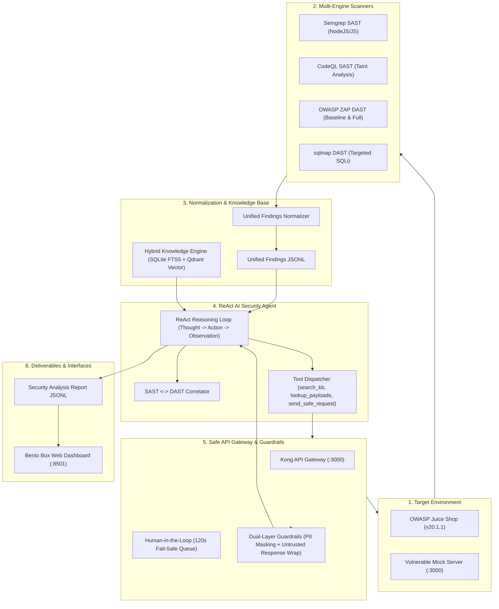

# Project Sentinel — Automated DevSecOps & ReAct AI Security Operations Platform

Project Sentinel là nền tảng DevSecOps tự động hóa toàn diện, cung cấp môi trường phân tích bảo mật có thể tái lập trên ứng dụng mục tiêu được cấp phép (OWASP Juice Shop `v20.1.1` & Vulnerable Mock Server). Hệ thống tích hợp quét mã nguồn tĩnh (SAST), quét lỗ hổng động (DAST), chuẩn hóa kết quả sang Unified Findings JSONL, truy hồi tri thức bảo mật đa phương thức (Hybrid Search FTS5 + Qdrant), và **ReAct Security Analysis Agent** với khả năng tự trị gọi công cụ kiểm chứng lỗ hổng qua **API Gateway**, bảo vệ bởi **Dual-Layer Guardrails** (khử khuẩn PII/Secrets, ngăn chặn Prompt Injection) và chốt chặn phê duyệt của con người (**Human-in-the-Loop**).

---

## 📑 Mục lục

- [Tổng quan Kiến trúc](#-tổng-quan-kiến-trúc)
- [Yêu cầu Hệ thống](#-yêu-cầu-hệ-thống)
- [Cài đặt & Khởi tạo Nhanh (Quickstart)](#-cài-đặt--khởi-tạo-nhanh-quickstart)
- [Cấu hình Biến Môi Trường (.env)](#-cấu-hình-biến-môi-trường-env)
- [Hướng dẫn Vận hành Full Luồng (End-to-End Workflow)](#-hướng-dẫn-vận-hành-full-luồng-end-to-end-workflow)
  - [Lựa chọn 1: Vận hành qua Giao diện Web (Streamlit Bento Dashboard)](#lựa-chọn-1-vận-hành-qua-giao-diện-web-streamlit-bento-dashboard)
  - [Lựa chọn 2: Vận hành qua Dòng lệnh CLI (Makefile Commands)](#lựa-chọn-2-vận-hành-qua-dòng-lệnh-cli-makefile-commands)
- [Kiểm thử & Đảm bảo Chất lượng](#-kiểm-thử--đảm-bảo-chất-lượng)
- [Gitleaks Git hooks](#gitleaks-git-hooks)
- [CI/CD GitHub Actions](#-cicd-github-actions)
- [Dọn dẹp Môi trường (Cleanup)](#-dọn-dẹp-môi-trường-cleanup)
- [Xử lý Sự cố Thường gặp (Troubleshooting)](#-xử-lý-sự-cố-thường-gặp-troubleshooting)

---

## 🏛️ Tổng quan Kiến trúc



---

## 💻 Yêu cầu Hệ thống

- **Hệ điều hành**: Linux x86_64, macOS (Docker Desktop), hoặc Windows WSL2 (Docker Desktop).
- **Công cụ cơ sở**: Git, GNU Make, Bash, Docker & Docker Compose v2, `curl`, `jq`.
- **Python**: Python 3.11 hoặc 3.12 (khuyến nghị dùng virtualenv `.venv`).
- **Gitleaks**: `v8.30.1+` (bảo vệ secret scanning qua pre-commit / pre-push hooks).

### ⚙️ Cấu hình phần cứng:
| Mức cấu hình | RAM | CPU Cores | Ổ cứng khả dụng | Khả năng đáp ứng |
| :--- | :--- | :--- | :--- | :--- |
| **Tối thiểu (Minimum)** | 8 GB (Cấp 6GB cho Docker) | 4 cores | 15 GB SSD | Web UI, Target App, Semgrep SAST, ZAP Baseline |
| **Khuyến nghị (Recommended)** | 16 GB (Cấp 12GB cho Docker) | 6 – 8 cores | 30 GB SSD | CodeQL Database Build, ZAP Full Scan Spider, ReAct Multi-turn Probing |

---

## 🚀 Cài đặt & Khởi tạo Nhanh (Quickstart)

Chỉ với 5 bước đơn giản để thiết lập toàn bộ môi trường từ đầu:

```bash
# 1. Kiểm tra môi trường host và Docker daemon
make doctor

# 2. Khởi tạo môi trường ảo Python & cài đặt dependencies
make install
source .venv/bin/activate

# 3. Tạo file cấu hình môi trường từ mẫu
cp .env.example .env
# Chỉnh sửa API Key hoặc Model trong file .env (xem mục Cấu hình bên dưới)

# 4. Tải và khởi tạo ứng dụng mục tiêu (OWASP Juice Shop)
make setup-target
make target-build

# 5. Xây dựng Kho Tri thức Bảo mật (SQLite FTS5 & Vector Store)
make kb-build
```

---

## ⚙️ Cấu hình Biến Môi Trường (.env)

Tập tin `.env` quản lý các API Key và cấu hình hoạt động:

```env
# 1. Cấu hình Ứng dụng Mục tiêu & Scanner
JUICE_SHOP_PORT=3000
SEMGREP_APP_TOKEN=your-semgrep-token-here

# 2. Cấu hình AI Security Analysis Agent (LLM)
LLM_API_KEY=your-llm-api-key-here
LLM_BASE_URL=https://dashscope.aliyuncs.com/compatible-mode/v1
LLM_MODEL=qwen-plus
LLM_TEMPERATURE=0.1
LLM_MAX_RETRIES=2

# 3. Cấu hình Embedding Provider (Truy hồi Ngữ nghĩa)
# Hỗ trợ: 'fastembed' (100% Offline ONNX - Mặc định), 'dashscope', 'openai', 'mock'
EMBEDDING_PROVIDER=fastembed
EMBEDDING_MODEL=sentence-transformers/all-MiniLM-L6-v2
EMBEDDING_DIMENSION=384

# 4. Cấu hình API Gateway & Human-In-The-Loop
GATEWAY_HOST=http://localhost:3000
GATEWAY_AGENT_API_KEY=sentinel-agent-safe-key-prod-2026
HITL_TIMEOUT_SECONDS=120
```

---

## 🛡️ Hướng dẫn Vận hành Full Luồng (End-to-End Workflow)

Hệ thống hỗ trợ 2 phương thức vận hành song song và đồng bộ 100%:

---

### Lựa chọn 1: Vận hành qua Giao diện Web (Streamlit Bento Dashboard)

Khởi động giao diện Web Dashboard Bento Box:
```bash
make ui-build    # Build container UI
make ui          # Khởi động UI tại http://localhost:8501
```

Truy cập **`http://localhost:8501`** để thao tác trên **6 Bento Tabs**:

1. **Tab 1: Quét Bảo Mật (Security Scanning)**: Chọn 1 trong 8 công cụ quét (Semgrep, CodeQL, ZAP Baseline/Admin/Full, sqlmap), bấm *Khởi Chạy Quét* để theo dõi live log stream và kiểm tra trạng thái Target.
2. **Tab 2: Quản Lý Dữ Liệu (Data Management)**: Lựa chọn tệp raw report với cơ chế *Chọn tất cả / Từng tệp*, tải lên tệp mới, bấm *Chuẩn Hóa Báo Cáo* sang Unified Findings JSONL và xem trước nội dung.
3. **Tab 3: Tra Cứu Tri Thức (Knowledge Retrieval)**: Tìm kiếm Hybrid / Keyword / Semantic trên 442+ Canonical Docs (CWE, OWASP Top 10, ASVS), lọc theo loại tài liệu và Top-K.
4. **Tab 4: Kiểm Thử Gateway (Active Gateway Testing)**: Safe Requester Console, nhập endpoint, phương thức (`GET`/`PUT`/`OPTIONS`), tùy biến headers, rate limit burst, gửi probe và xem phản hồi đã qua khử khuẩn.
5. **Tab 5: Báo Cáo & Phân Tích (AI Security Agent)**: Chọn findings đầu vào, cấu hình LLM Model, chế độ `react`/`static`, bấm *Khởi Chạy Phân Tích* để xem Executive Threat & Guardrails KPI Grid và Bảng Phân Tích Lỗ Hổng Theo Nhóm.
6. **Tab 6: Giám Sát & Logs (Monitoring & Observability)**: Theo dõi trực tiếp Live Gateway Network Audit Logs (`logs/gateway-network-audit.jsonl`) và Agent Execution Logs (`logs/agent-runner.log`).
- **Sidebar: Hàng Đợi Phê Duyệt (HITL Approval Queue)**: Theo dõi và duyệt/từ chối các request kiểm thử rủi ro trong thời gian thực với bộ đếm ngược 120s Fail-Safe.

---

### Lựa chọn 2: Vận hành qua Dòng lệnh CLI (Makefile Commands)

Mọi tính năng trên giao diện UI đều có lệnh `make` tương ứng trực tiếp:

#### 1. Quét SAST & DAST (Tương đương Tab 1)

##### A. Quét SAST (Semgrep & CodeQL)
- **Semgrep SAST**: `make sast-semgrep` (quét rulesets NodeJS/JS với token `SEMGREP_APP_TOKEN`). Output: `reports/raw/semgrep.json`.
- **CodeQL SAST**: `make sast-codeql` (quét deep taint analysis, thêm 2 dòng ngữ cảnh mã nguồn bằng `--sarif-add-snippets`). Output: `reports/raw/codeql.sarif`.
- **Quét SAST liên hoàn**: `make sast`.

##### B. Quét DAST (OWASP ZAP & sqlmap)

### Chạy ZAP Baseline local (passive)
- **Lệnh**: `make dast` (User) hoặc `make dast-zap-admin` (Admin).
- **Automation Plans**: Đặt tại `configs/zap/` (`baseline.yaml` và `baseline-admin.yaml`).
- **Strict Scope Guardrail**: Cấu hình `scopeCheck: Strict` cho Client Spider để ngăn browser điều hướng ra bên ngoài target (ví dụ URI `https://github.com/juice-shop/juice-shop`).
- **Artifacts**: Xuất `reports/raw/zap.json`, `zap.meta.json`, `zap-endpoints.txt` (endpoint inventory) và `zap-site-tree.yaml` (ZAP site tree).

### Chạy ZAP Full Scan local (active)
- **Lệnh**: `make dast-zap-fullscan` (User) hoặc `make dast-zap-fullscan-admin` (Admin).
- **Automation Plans**: Đặt tại `configs/zap/` (`full.yaml` và `full-admin.yaml`).
- **Artifacts & Log**: Xuất `reports/raw/zap.json`, `zap.meta.json`, `zap-endpoints.txt`, `zap-site-tree.yaml` và log `logs/zap-fullscan-runner.log`.

##### C. sqlmap DAST (Targeted SQL Injection)
- **Lệnh**: `make dast-sqlmap` (kiểm thử tham số `q` tại `/rest/products/search`). Output: `reports/raw/sqlmap.json`.
- **Quét toàn bộ SAST & DAST liên hoàn**: `make sast && make dast`.

---

#### 2. Chuẩn hóa Scanner Reports sang Unified Findings (Tương đương Tab 2)
```bash
# Xác thực tính hợp lệ của các file raw reports trong reports/raw/
make validate-reports

# Chuẩn hóa toàn bộ sang reports/normalized/unified-findings-YYYYMMDDTHHMMSSZ.jsonl
make normalize
```
*Lưu ý: Normalizer chỉ giữ lại các finding có origin trùng khớp chính xác với target scope. Số instance ngoài scope bị loại bỏ được ghi nhận tại `out_of_scope_instances_filtered` trong normalization summary.*

---

#### 3. Tra cứu Tri thức Bảo mật (Tương đương Tab 3)
```bash
# Tìm kiếm Hybrid (RRF + MMR - Mặc định)
make kb-search QUERY="SQL Injection" TOP_K=5

# Tìm kiếm Từ khóa FTS5 BM25 (Hỗ trợ mã định danh và từ khóa tiếng Việt)
make kb-search-keyword QUERY="CWE-89"
make kb-search-keyword QUERY="XSS và CSRF"

# Tìm kiếm Ngữ nghĩa Vector
make kb-search-semantic QUERY="bypassing authentication via missing jwt validation"

# Tra cứu chi tiết toàn văn 1 tài liệu theo mã
make kb-inspect DOC_ID=cwe-89

# Xem thống kê số lượng tài liệu theo danh mục
make kb-stats
```

---

#### 4. Kiểm thử An toàn qua API Gateway (Tương đương Tab 4)
```bash
# Khởi động Kong Gateway và Target App cùng lúc (:3000)
make gateway-up

# Gửi request thăm dò an toàn (GET - rủi ro thấp)
make test-request ARGS="--url /rest/products/search?q=apple"

# Kiểm tra CORS & Phương thức cho phép (OPTIONS)
make test-request ARGS="--url /api/Products --method OPTIONS"

# Gửi request PUT (Kích hoạt chốt chặn phê duyệt HITL 120s)
make test-request ARGS="--url /rest/products/1/reviews --method PUT --payload-category special_chars"

# Kiểm tra Gateway chặn Rate Limit (Burst 25 requests -> HTTP 429)
make test-request ARGS="--url /api/Products --method GET --count 25"

# Kiểm tra Gateway chặn Payload ngoại cỡ (1.5MB Buffer -> HTTP 413)
make test-request ARGS="--url /api/Products --method GET --oversized"
```

---

#### 5. Phân tích Chuyên sâu với ReAct AI Agent (Tương đương Tab 5)
```bash
# 1. Chạy ReAct Agent (MẶC ĐỊNH - Tự động gọi Tool tra cứu KB và Probe Gateway):
make agent-analyze FINDINGS=reports/normalized/unified-findings-20260822T000000Z.jsonl

# 2. Tùy chỉnh số bước suy luận tối đa và Model LLM:
make agent-analyze FINDINGS=reports/normalized/unified-findings-20260822T000000Z.jsonl MODE=react MAX_STEPS=5 MODEL=qwen-plus

# 3. Chạy chế độ Static 1-Pass RAG (Baseline đối soát benchmark):
make agent-analyze FINDINGS=reports/normalized/unified-findings-20260822T000000Z.jsonl MODE=static
```

---

#### 6. Chạy Demo Tự Động 4 Giai Đoạn (Live Mock Probe Demo)
```bash
# Chạy kịch bản thực nghiệm đối soát Guardrails và ReAct Agent với Vulnerable Mock Server
make test-live-mock-probe
```

---

## 🧪 Kiểm thử & Đảm bảo Chất lượng

Chạy toàn bộ các bộ kiểm thử tự động của dự án:

```bash
make quality              # Kiểm tra toàn diện: Ruff linter, shell syntax, compose config và schema contracts
make test                 # Chạy unit & integration tests cho normalizers và platform (125 tests)
make kb-test              # Chạy tests cho Knowledge Base, SQLite FTS5, FastEmbed và Hybrid Search (137 tests)
make gateway-test         # Chạy tests cho Kong Gateway, Safe Requester, HITL và Audit Logger (37 tests)
make agent-test           # Chạy test suite cho ReAct Security Analysis Agent & Tools (73 tests)
make test-mock-guardrails # Chạy test thực nghiệm bảo vệ Guardrails trên Vulnerable Mock Server
```

---

## Gitleaks Git hooks

Repository cung cấp hai native Git hooks để quét secret:
- `.githooks/pre-commit`: Quét chính xác nội dung đang được stage;
- `.githooks/pre-push`: Quét các commit sắp được đẩy lên remote. Với branch hoặc tag mới, hook quét toàn bộ lịch sử có thể truy cập từ ref đó.

Hooks yêu cầu Gitleaks `v8.30.1` trở lên. Kiểm tra phiên bản đang có:
```bash
gitleaks version
```

### Kích hoạt hooks:
```bash
git config --local core.hooksPath .githooks
```

Quét toàn bộ lịch sử trước lần push đầu tiên:
```bash
gitleaks git --redact --verbose .
```

---

## 🔄 CI/CD GitHub Actions

Workflow chính chạy `quality`, sau đó khởi chạy SAST và ZAP Baseline DAST song song trên GitHub Actions.
Mỗi workflow run xuất bản các artifacts:
- `semgrep-raw-<run_id>`
- `codeql-raw-<run_id>`
- `zap-raw-<run_id>`
- `zap-fullscan-raw-<run_id>`
- `normalized-findings-<run_id>`
- `dast-logs-<run_id>`

---

## 🧹 Dọn dẹp Môi trường (Cleanup)

```bash
# Xóa các báo cáo tạm trong reports/raw/ và reports/normalized/
make clean-reports

# Dừng Kong Gateway và Juice Shop target
make gateway-down

# Dừng riêng Web UI Dashboard
make ui-down

# Dừng toàn bộ containers và mạng Docker của Sentinel
make down

# Xóa container, Docker volumes và thư mục target clone
make clean
```

---

## ❓ Xử lý Sự cố Thường gặp (Troubleshooting)

| Vấn đề | Nguyên nhân | Cách khắc phục |
| :--- | :--- | :--- |
| **Port 3000 bị chiếm dụng** | Ứng dụng khác đang chạy trên port 3000 | Đổi `JUICE_SHOP_PORT=3001` trong `.env`, sau đó chạy `make target-up` hoặc `make gateway-up`. |
| **`ModuleNotFoundError: No module named '_sqlite3'`** | Python thiếu header SQLite khi biên dịch | Chạy `make install` để hệ thống tự kiểm tra và cấu hình môi trường ảo Python có sẵn SQLite FTS5. |
| **Lệch số chiều Vector (`shapes not aligned`)** | Dimension giữa model và Qdrant collection không khớp | Kiểm tra `EMBEDDING_PROVIDER` trong `.env` (`384` cho FastEmbed, `1024` cho DashScope, `1536` cho OpenAI) rồi chạy `make kb-rebuild`. |
| **Semgrep báo thiếu token** | Chưa cấu hình token xác thực | Thêm `SEMGREP_APP_TOKEN` hợp lệ vào `.env` trước khi chạy `make sast-semgrep`. |
| **CodeQL báo `out of Java heap`** | Docker Daemon thiếu RAM | Tăng bộ nhớ Docker Engine/Desktop lên ít nhất 4 GB (khuyến nghị 8–12 GB). |
| **HITL Request bị Timeout sau 120s** | Không có tương tác Approve/Reject kịp thời | Đây là cơ chế Fail-Safe mặc định (tự động từ chối request rủi ro). Bấm gửi lại hoặc thêm flag `--auto-approve` khi chạy CI tự động. |
