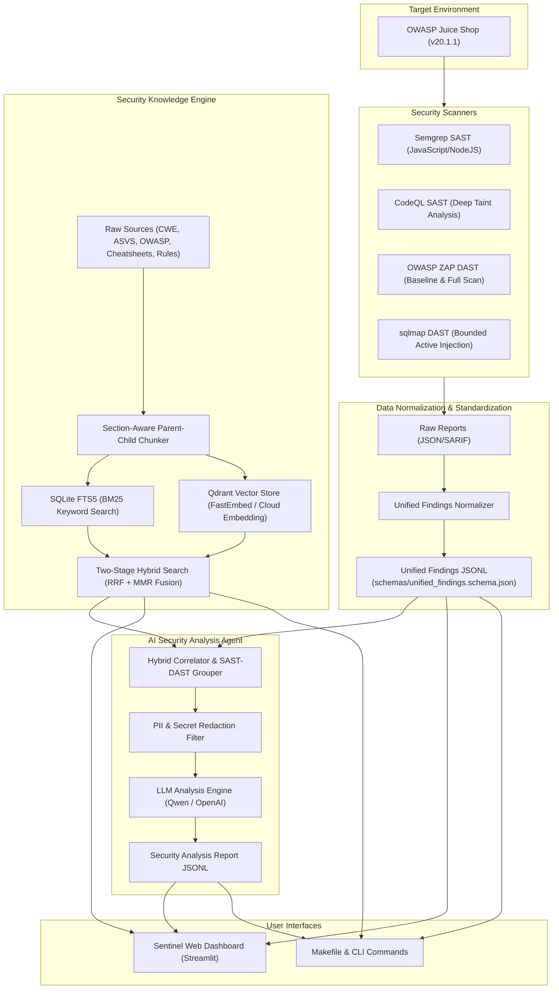

# Project Sentinel — Automated DevSecOps & AI-Powered Security Analysis Platform

Project Sentinel là nền tảng DevSecOps tự động hóa toàn diện, cung cấp môi trường phân tích bảo mật có thể tái lập trên ứng dụng mục tiêu OWASP Juice Shop `v20.1.1`. Hệ thống tích hợp quét mã nguồn tĩnh (SAST), quét lỗ hổng động (DAST), chuẩn hóa kết quả sang Unified Findings, công cụ truy hồi tri thức bảo mật đa phương thức (Hybrid Search), và **Security Analysis Agent** chạy mô hình ngôn ngữ lớn (LLM) để phân tích, tương quan (correlation) và đề xuất giải pháp vá lỗi tự động.

---

## 📑 Mục lục

- [Tổng quan Kiến trúc](#tổng-quan-kiến-trúc)
- [Yêu cầu hệ thống](#yêu-cầu-hệ-thống)
- [Cài đặt & Khởi tạo Nhanh (Quickstart)](#cài-đặt--khởi-tạo-nhanh-quickstart)
- [Cấu hình Biến Môi Trường (.env)](#cấu-hình-biến-môi-trường-env)
- [Hướng dẫn Sử dụng Hệ thống Tìm kiếm Tri thức Bảo mật](#hướng-dẫn-sử-dụng-hệ-thống-tìm-kiếm-tri-thức-bảo-mật)
  - [1. Tìm kiếm trên Giao diện Web (Streamlit UI)](#1-tìm-kiếm-trên-giao-diện-web-streamlit-ui)
  - [2. Tìm kiếm qua Dòng lệnh CLI (Makefile & Python CLI)](#2-tìm-kiếm-qua-dòng-lệnh-cli-makefile--python-cli)
  - [3. Tích hợp trực tiếp trong Python Code](#3-tích-hợp-trực-tiếp-trong-python-code)
- [Quy trình Quét & Phân tích Bảo mật Đầu-Cuối (End-to-End Workflow)](#quy-trình-quét--phân-tích-bảo-mật-đầu-cuối-end-to-end-workflow)
  - [1. Quét SAST (Semgrep & CodeQL)](#1-quét-sast-semgrep--codeql)
  - [2. Quét DAST (OWASP ZAP & sqlmap)](#2-quét-dast-owasp-zap--sqlmap)
  - [3. Chuẩn hóa Scanner Reports sang Unified Findings](#3-chuẩn-hóa-scanner-reports-sang-unified-findings)
  - [4. Phân tích Chuyên sâu với AI Security Agent](#4-phân-tích-chuyên-sâu-với-ai-security-agent)
- [Kiểm thử & Đảm bảo Chất lượng](#kiểm-thử--đảm-bảo-chất-lượng)
- [Gitleaks Git hooks](#gitleaks-git-hooks)
- [CI/CD GitHub Actions](#cicd-github-actions)
- [Dọn dẹp Môi trường (Cleanup)](#dọn-dẹp-môi-trường-cleanup)
- [Xử lý Sự cố Thường gặp (Troubleshooting)](#xử-lý-sự-cố-thường-gặp-troubleshooting)

---

## 🏛️ Tổng quan Kiến trúc



---

## 💻 Yêu cầu hệ thống

- **Hệ điều hành**: Linux x86_64, macOS (Docker Desktop), hoặc Windows WSL2 (Docker Desktop).
- **Công cụ cơ sở**: Git, Bash, GNU Make, Docker Engine/Desktop, Docker Compose v2, `curl`, `jq`.
- **Python**: Python 3.11 hoặc 3.12 (khuyến nghị dùng virtualenv `.venv`).
- **Gitleaks**: `v8.30.1+` (khuyến nghị cho secret-scanning pre-commit hooks).

### ⚙️ Cấu hình phần cứng khuyến nghị:
| Mức cấu hình | RAM | CPU Cores | Ổ cứng khả dụng | Ghi chú |
| :--- | :--- | :--- | :--- | :--- |
| **Tối thiểu (Minimum)** | 8 GB (Cấp 6GB cho Docker) | 4 cores | 15 GB SSD | Đủ chạy Web UI, Target App, Semgrep, ZAP Baseline |
| **Khuyến nghị (Recommended)** | 16 GB (Cấp 12GB cho Docker) | 6 – 8 cores | 30 GB SSD | Chạy mượt mà CodeQL Database build & ZAP Full Scan Spider |

---

## 🚀 Cài đặt & Khởi tạo Nhanh (Quickstart)

Chỉ với 5 bước đơn giản để thiết lập toàn bộ môi trường từ đầu:

```bash
# 1. Kiểm tra môi trường host
make doctor

# 2. Khởi tạo môi trường ảo Python & cài đặt dependencies
make install
source .venv/bin/activate

# 3. Tạo file cấu hình môi trường
cp .env.example .env
# Chỉnh sửa API Key hoặc provider trong file .env (xem mục Cấu hình bên dưới)

# 4. Tải và khởi chạy Target App (OWASP Juice Shop)
make setup-target
make target-build
make target-up
make target-wait

# 5. Xây dựng Kho Tri thức Bảo mật (SQLite FTS5 & Vector Store)
make kb-build
```

### Khởi chạy Giao diện Web App (Dashboard):
```bash
make ui-build
make ui
```
Mở trình duyệt tại: **`http://localhost:8501`** để trải nghiệm giao diện trực quan.

---

## ⚙️ Cấu hình Biến Môi Trường (.env)

Tập tin `.env` quản lý các API Key và cấu hình hoạt động:

```env
# 1. Target App & Scanner Configuration
JUICE_SHOP_PORT=3000
SEMGREP_APP_TOKEN=your-semgrep-token-here

# 2. Security Analysis Agent (LLM) Configuration
LLM_API_KEY=your-llm-api-key-here
LLM_BASE_URL=https://dashscope.aliyuncs.com/compatible-mode/v1
LLM_MODEL=qwen-plus
LLM_TEMPERATURE=0.1
LLM_MAX_RETRIES=2

# 3. Embedding Provider Configuration (cho Semantic & Hybrid Search)
# Các provider hỗ trợ: 'fastembed' (Offline ONNX), 'dashscope' (Alibaba), 'openai', 'mock'
EMBEDDING_PROVIDER=fastembed

# Cấu hình Offline Semantic Search (Mặc định - Miễn phí, 100% Offline, không cần API Key):
EMBEDDING_MODEL=sentence-transformers/all-MiniLM-L6-v2
EMBEDDING_DIMENSION=384

# Cấu hình khi dùng Cloud API Alibaba DashScope:
# EMBEDDING_PROVIDER=dashscope
# EMBEDDING_API_KEY=sk-...
# EMBEDDING_BASE_URL=https://dashscope.aliyuncs.com/compatible-mode/v1
# EMBEDDING_MODEL=text-embedding-v4
# EMBEDDING_DIMENSION=1024

# Cấu hình khi dùng Cloud API OpenAI:
# EMBEDDING_PROVIDER=openai
# EMBEDDING_API_KEY=sk-...
# EMBEDDING_MODEL=text-embedding-3-small
# EMBEDDING_DIMENSION=1536
```

---

## 🔍 Hướng dẫn Sử dụng Hệ thống Tìm kiếm Tri thức Bảo mật

Sentinel xây dựng kho tri thức **1.851 tài liệu bảo mật chuẩn hóa** (CWE, OWASP Top 10, ASVS, Cheatsheets, Scanner Rules, Vulnerability Examples) được chia nhỏ thành **4.630 Child Vectors** theo cấu trúc Heading H2/H3.

Hệ thống hỗ trợ 3 chế độ tìm kiếm:
1. **`hybrid` (Mặc định - Khuyên dùng)**: Kết hợp Sparse BM25 (FTS5) và Dense Vector (Qdrant) qua giải thuật Reciprocal Rank Fusion (RRF) và lọc trùng lặp Maximal Marginal Relevance (MMR).
2. **`keyword`**: Tìm kiếm từ khóa chính xác qua SQLite FTS5 (tối ưu tra cứu mã định danh `CWE-89`, `A01:2025`, `IDOR`).
3. **`semantic`**: Tìm kiếm ngữ nghĩa qua Vector Embedding (tối ưu hiểu câu hỏi tự nhiên và mô tả kỹ thuật).

---

### 1. Tìm kiếm trên Giao diện Web (Streamlit UI)

1. Khởi động Web UI: `make ui` $\rightarrow$ Mở `http://localhost:8501`.
2. Chuyển sang trang **📚 Knowledge Base**:
   - **Hộp tìm kiếm (Search Query)**: Nhập từ khóa, mã CWE hoặc câu hỏi tự nhiên (ví dụ: `how to prevent broken access control`, `CWE-89`, `XSS and CSRF`).
   - **Chế độ tìm kiếm (Search Mode)**: Chọn `hybrid`, `keyword` hoặc `semantic`.
   - **Bộ lọc loại tài liệu (Document Type Filter)**: Thu hẹp phạm vi theo `cwe`, `owasp_category`, `cheatsheet`, `vulnerability_example`, `asvs_requirement`, `scanner_rule`.
   - **Số lượng kết quả (Top K)**: Điều chỉnh từ 1 đến 50 kết quả.
3. **Trực quan hóa kết quả**:
   - Thẻ kết quả hiển thị Thứ hạng (Rank), Điểm số tương đồng, Mã định danh và Trích đoạn Section trúng đích (`matched_snippet`).
   - Nhấp vào từng kết quả để mở rộng xem toàn văn tài liệu gốc, hướng dẫn khắc phục và kịch bản khai thác an toàn.

---

### 2. Tìm kiếm qua Dòng lệnh CLI (Makefile & Python CLI)

#### A. Tìm kiếm Hybrid (RRF + MMR - Mặc định):
```bash
make kb-search QUERY="SQL Injection"
make kb-search QUERY="how to prevent broken access control" TOP_K=5
make kb-search QUERY="parameterized queries" MODE=hybrid
```

#### B. Tìm kiếm Từ khóa Thông minh (Keyword / BM25 Search):
Hỗ trợ liên từ tiếng Việt (`và`, `hoặc`, `hay`, dấu phẩy) và tiếng Anh (`and`, `or`, `with`):
```bash
make kb-search-keyword QUERY="CWE-89"
make kb-search QUERY="cwe 89 và owasp a05:2025" MODE=keyword
make kb-search QUERY="XSS, CSRF, IDOR" MODE=keyword
```

#### C. Tìm kiếm Ngữ nghĩa (Dense Vector Search):
```bash
make kb-search-semantic QUERY="leaking database error messages to users"
make kb-search QUERY="unauthorized user access to another account orders" MODE=semantic TOP_K=5
```

#### D. Lọc theo Loại Tài liệu (`DOC_TYPE`):
```bash
make kb-search QUERY="IDOR" DOC_TYPE=cwe
make kb-search QUERY="JWT signing" DOC_TYPE=vulnerability_example
make kb-search QUERY="Session Management" DOC_TYPE=asvs_requirement
make kb-search QUERY="Cross-Site Scripting" DOC_TYPE=cheatsheet
```

Các giá trị `DOC_TYPE` hợp lệ:
- `cwe`: Danh mục điểm yếu bảo mật chuẩn MITRE CWE.
- `owasp_category`: Danh mục rủi ro OWASP Top 10 (2017, 2021, 2025).
- `cheatsheet`: Tài liệu hướng dẫn phòng chống chuyên sâu OWASP Cheatsheets.
- `asvs_requirement`: Yêu cầu kiểm chuẩn bảo mật ứng dụng OWASP ASVS v5.0.
- `vulnerability_example`: Ví dụ code mẫu kèm mã sửa lỗi an toàn (Safe vs Vulnerable).
- `scanner_rule`: Quy tắc phân tích của Semgrep và cảnh báo ZAP.

#### E. Tra cứu Chi tiết & Thống kê Kho Tri thức:
```bash
make kb-inspect DOC_ID=cwe-89     # Xem toàn văn chi tiết 1 tài liệu
make kb-stats                     # Xem thống kê số lượng tài liệu theo từng loại
make kb-validate                  # Kiểm tra tính toàn vẹn của dữ liệu và SQLite FTS5
make kb-rebuild                   # Xóa và xây dựng lại toàn bộ DB & Vector Index
```

#### F. Xuất Kết quả dạng JSON cho Scripts & CI/CD:
```bash
.venv/bin/python -m src.retrieval.cli search "SQL Injection" --mode hybrid --top-k 5 --json
.venv/bin/python -m src.retrieval.cli search "CWE-89" --mode keyword --json
```

---

### 3. Tích hợp trực tiếp trong Python Code

Bạn có thể dễ dàng nhúng `KnowledgeSearchService` vào bất kỳ module Python hoặc Agent nào:

```python
from src.retrieval.service import KnowledgeSearchService

service = KnowledgeSearchService()

# 1. Tìm kiếm Hybrid 2 giai đoạn (RRF + MMR)
results = service.search(query="SQL Injection attack scenarios", mode="hybrid", top_k=5)

# 2. Tìm kiếm Từ khóa FTS5 BM25
results = service.search(query="CWE-89", mode="keyword", top_k=5)

# 3. Tìm kiếm Ngữ nghĩa Dense Vector
results = service.search(
    query="attacker bypasses authentication via missing middleware",
    mode="semantic",
    top_k=5,
)

for res in results:
    print(f"[{res.doc_type}] {res.doc_id}: {res.title} (Score: {res.score:.4f})")
    print(f"  Snippet: {res.snippet[:150]}...")
    # res.content chứa 100% full content của Parent Document để LLM phân tích
```

---

## 🛡️ Quy trình Quét & Phân tích Bảo mật Đầu-Cuối (End-to-End Workflow)

Toàn bộ quy trình quét, chuẩn hóa và phân tích có thể chạy tự động qua CLI:

```bash
# BƯỚC 1: Quét SAST và DAST
make sast              # Chạy Semgrep và CodeQL phân tích mã nguồn
make dast              # Chạy OWASP ZAP Baseline DAST
make dast-sqlmap       # Chạy sqlmap kiểm thử SQL Injection

# BƯỚC 2: Kiểm tra và Chuẩn hóa Scanner Reports
make validate-reports  # Xác thực định dạng raw reports trong reports/raw/
make normalize         # Chuẩn hóa sang reports/normalized/unified-findings-*.jsonl

# BƯỚC 3: Kích hoạt AI Security Analysis Agent
make agent-analyze FINDINGS=reports/normalized/unified-findings-YYYYMMDDTHHMMSSZ.jsonl
```

---

### 1. Quét SAST (Semgrep & CodeQL)

#### A. Semgrep SAST
- **Lệnh**: `make sast-semgrep` (chạy riêng) hoặc `make sast` (chạy Semgrep rồi CodeQL).
- **Cấu hình**: Image `semgrep/semgrep:1.171.0`, rulesets `p/owasp-top-ten`, `p/javascript`, `p/nodejs`, `p/expressjs`.
- **Scope**: Cho phép theo `configs/semgrep/includes.txt` và loại trừ theo `configs/semgrep/.semgrepignore`. Loại bỏ `node_modules/`, test, CI và static codefixes.
- **Yêu cầu**: Biến môi trường `SEMGREP_APP_TOKEN` (export trong shell hoặc đặt trong `.env`). Output: `reports/raw/semgrep.json`.

#### B. CodeQL SAST
- **Lệnh**: `make sast-codeql`.
- **Image & Build**: Build từ `ubuntu:24.04` và CodeQL bundle dựa trên `CODEQL_VERSION` trong `configs/tool-versions.env`.
- **Phân tích & Snippets**: Chạy suite `javascript-security-extended.qls`. Truyền `--sarif-add-snippets` để đưa 2 dòng ngữ cảnh mã nguồn vào raw SARIF.
- **Output**: `reports/raw/codeql.sarif`. Database tạm trong container tự xóa sau khi hoàn tất.

---

### 2. Quét DAST (OWASP ZAP & sqlmap)

### Chạy ZAP Baseline local (passive)
Baseline thực hiện spider và passive scan, không chạy active scan:
- **Image & Target**: Image `ghcr.io/zaproxy/zaproxy:2.17.0`, quét target cố định `http://juice-shop:3000` trong network `sentinel-security`.
- **Lệnh Quét & Authentication**:
  - Mặc định (`make dast`): Quét Authenticated bằng tài khoản User (`user@juice-sh.op`).
  - Quét riêng Admin (`make dast-zap-admin`): Quét Authenticated bằng tài khoản Admin (`admin@juice-sh.op`).
- **Automation Plans**: Đặt tại `configs/zap/` (`baseline.yaml` cho User; `baseline-admin.yaml` cho Admin).
- **Strict Scope Guardrail**: Đặt `scopeCheck: Strict` cho Client Spider để ngăn browser điều hướng ra bên ngoài target (ví dụ URI `https://github.com/juice-shop/juice-shop`).
- **Artifacts**: Xuất 4 file: `zap.json`, `zap.meta.json`, `zap-endpoints.txt` (endpoint inventory) và `zap-site-tree.yaml` (ZAP site tree).

### Chạy ZAP Full Scan local (active)
ZAP Full Scan kích hoạt active scanner để phát hiện chuyên sâu các lỗ hổng Injection, XSS, CSRF:
- **Lệnh**: `make dast-zap-fullscan` (User) hoặc `make dast-zap-fullscan-admin` (Admin).
- **Automation Plans**: Đặt tại `configs/zap/` (`full.yaml` cho User; `full-admin.yaml` cho Admin).
- **Artifacts & Log**: Xuất `reports/raw/zap.json`, `zap.meta.json`, `zap-endpoints.txt`, `zap-site-tree.yaml` và log `logs/zap-fullscan-runner.log`.

#### sqlmap DAST (Bounded Active Scan)
- **Lệnh**: `make dast-sqlmap`.
- **Scope**: Chỉ kiểm thử tham số `q` tại `GET /rest/products/search?q=apple` bằng image `sentinel/sqlmap:1.10.7`.
- **Output**: `reports/raw/sqlmap.json` và log `logs/sqlmap-runner.log`.

---

### 3. Chuẩn hóa Scanner Reports sang Unified Findings

Lệnh `make normalize` chuẩn hóa các raw report từ scanner thành định dạng thống nhất tại `reports/normalized/unified-findings-YYYYMMDDTHHMMSSZ.jsonl` và `normalization-summary.json`.

#### Các cặp Report & Metadata bắt buộc (`reports/raw/`):
| Scanner | Raw Finding Report | Sidecar Metadata |
| --- | --- | --- |
| Semgrep | `semgrep.json` | `semgrep.meta.json` |
| ZAP | `zap.json` | `zap.meta.json` |
| CodeQL | `codeql.sarif` | `codeql.meta.json` |

#### Quy tắc xử lý:
- **Lọc Out-of-Scope**: ZAP normalizer chỉ giữ lại các finding có HTTP origin trùng khớp chính xác với `target.base_url`. Số instance ngoài scope bị bỏ được ghi vào `out_of_scope_instances_filtered` trong summary.
- **Validation & Partial Failure**: `make validate-reports` kiểm tra các file rỗng/thiếu/malformed trước khi scan. Khi normalize, nếu thiếu input scanner sẽ có status `skipped` (`missing_input`), scanner hỏng có status `failed`. Chỉ cần ít nhất 1 cặp scanner hợp lệ, output normalized vẫn được tạo.

---

### 4. Phân tích Chuyên sâu với AI Security Agent

AI Security Analysis Agent thực hiện phân tích tự động theo quy trình 3 giai đoạn:
1. **Pre-Grouping & Correlation Engine**:
   - Gom nhóm lỗ hổng theo `group_key` chuẩn hóa từ scanner.
   - Quét quan hệ tương quan cross-tool **SAST ↔ DAST** dựa trên CWE Intersection, Title Similarity và Parameter-to-DataFlow Matching. Đánh dấu `correlation_type = "sast_dast_suspected"`.
2. **Agentic Analysis Loop & Knowledge Retrieval**:
   - Tự động truy hồi tri thức bảo mật từ SQLite Knowledge Base theo từng CWE ID và từ khóa lỗ hổng.
   - Lọc che dữ liệu nhạy cảm (Email, Phone, JWT Tokens, Passwords) trước khi đưa vào LLM prompt.
   - Gọi LLM qua OpenAI-compatible API với System Prompt versioned tại `src/agent/prompts/system_v1.md`.
3. **Post-Processing & Coverage Verification**:
   - Đảm bảo 100% fingerprints đầu vào đều có kết quả phân tích (hoặc fallback an toàn).
   - Xuất báo cáo JSONL tại `reports/analyzed/security-analysis-report-YYYYMMDDTHHMMSSZ.jsonl` và summary tại `reports/analyzed/analysis-summary-YYYYMMDDTHHMMSSZ.json`.

---

## 🧪 Kiểm thử & Đảm bảo Chất lượng

Chạy toàn bộ các bộ kiểm thử tự động của dự án:

```bash
make quality       # Kiểm tra toàn diện: linter Ruff, shell scripts, compose config và 125 test suites
make test          # Chạy unit & integration tests cho normalizers và platform
make kb-test       # Chạy 137 tests cho Knowledge Base, SQLite FTS5, FastEmbed và Hybrid Search
make agent-test    # Chạy test suite cho Security Analysis Agent
```

---

## Gitleaks Git hooks

Repository cung cấp hai native Git hooks:
- `.githooks/pre-commit` quét chính xác nội dung đang được stage;
- `.githooks/pre-push` quét các commit sắp được đẩy lên remote. Với branch hoặc tag mới, hook quét toàn bộ lịch sử có thể truy cập từ ref đó.

Hooks yêu cầu Gitleaks `v8.30.1` trở lên. Kiểm tra phiên bản đang có:
```bash
gitleaks version
```

### Kích hoạt hooks:
```bash
git config --local core.hooksPath .githooks
```

Quét toàn bộ lịch sử trước lần push đầu tiên:
```bash
gitleaks git --redact --verbose .
```

---

## 🔄 CI/CD GitHub Actions

Workflow chính chạy `quality`, sau đó khởi chạy SAST và ZAP Baseline DAST song song trên GitHub Actions.
Mỗi workflow run xuất bản các artifacts:
- `semgrep-raw-<run_id>`
- `codeql-raw-<run_id>`
- `zap-raw-<run_id>`
- `zap-fullscan-raw-<run_id>` (từ manual workflow)
- `normalized-findings-<run_id>`
- `dast-logs-<run_id>`

---

## 🧹 Dọn dẹp Môi trường (Cleanup)

- **Dọn dẹp Báo cáo Đã sinh ra**:
  ```bash
  make clean-reports   # Xóa reports/raw/ và reports/normalized/ (giữ lại .gitkeep)
  ```
- **Dọn dẹp Container & Dữ liệu Tạm của Target App**:
  ```bash
  make clean           # Dừng container, xóa Docker volumes và dọn dẹp clone Juice Shop
  ```
- **Dừng toàn bộ hệ thống Sentinel**:
  ```bash
  make down            # Dừng toàn bộ Docker containers (gồm cả Web UI Dashboard)
  ```

---

## ❓ Xử lý Sự cố Thường gặp (Troubleshooting)

| Vấn đề | Nguyên nhân | Cách khắc phục |
|---|---|---|
| **Port 3000 bị bận** | Ứng dụng khác đang dùng port 3000 | Đổi `JUICE_SHOP_PORT=3001` trong `.env`, sau đó chạy `make target-up`. |
| **`ModuleNotFoundError: No module named '_sqlite3'`** | Python trên host thiếu header SQLite khi build | Chạy `make install` để hệ thống tự động kiểm tra và chuyển sang runtime Python có sẵn SQLite FTS5. |
| **Lệch số chiều Vector (`shapes not aligned`)** | Dimension giữa model và Qdrant collection không khớp | Kiểm tra `EMBEDDING_PROVIDER` trong `.env` (`384` cho FastEmbed, `1024` cho DashScope, `1536` cho OpenAI) rồi chạy `make kb-rebuild`. |
| **Semgrep báo thiếu token** | Chưa cấu hình token xác thực | Thêm `SEMGREP_APP_TOKEN` hợp lệ vào `.env` trước khi chạy `make sast-semgrep`. |
| **CodeQL báo `out of Java heap`** | Docker Daemon thiếu RAM | Tăng bộ nhớ Docker Engine/Desktop lên ít nhất 4 GB (khuyến nghị 8–12 GB). |
