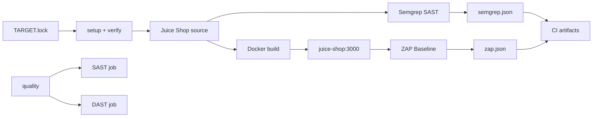

# Kiến trúc Week 1

## Thành phần

Target được pin tại OWASP Juice Shop `v20.1.1` (Node.js/Express backend và Angular frontend).
`make setup-target` clone source vào thư mục gitignored `target-app/juice-shop/` và
`verify-target.sh` kiểm tra remote, annotated tag, commit, version cùng trạng thái working tree.

Compose build trực tiếp upstream Dockerfile, publish mặc định tại `127.0.0.1:3000` và gắn
service `juice-shop` vào network có tên cố định `sentinel-security`. ZAP là one-shot container
trên network này; nó không phải service thường trực.

Semgrep đọc source read-only; chỉ report mount có quyền ghi. ZAP spider và passive scan target
qua Docker network. Raw reports nằm trong `reports/raw/` ở local và được upload làm CI artifact,
không commit vào Git.

## Trust boundaries

- Source target là dependency bên ngoài, được pin và kiểm tra nhưng không thuộc Sentinel.
- Semgrep Registry rulesets được tải từ dịch vụ remote và chưa được pin nội dung.
- Container scanner chỉ được cấp source read-only hoặc endpoint/network cần thiết.
- Dữ liệu từ target và scanner output là dữ liệu chưa tin cậy cho các component AI tương lai.
- Host port chỉ bind loopback, không expose Juice Shop trên `0.0.0.0`.

Normalizer, retrieval/RAG, Agent, Gateway, guardrails và ground-truth evaluation chưa được triển
khai trong Week 1.
