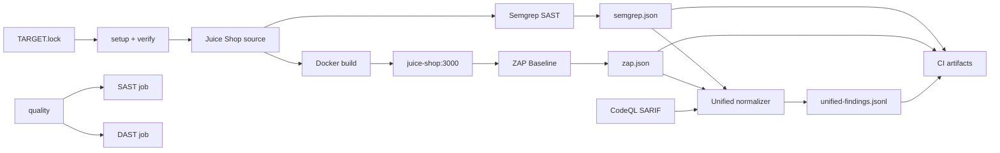

# Kiến trúc Week 1–2

## Thành phần

Target được pin tại OWASP Juice Shop `v20.1.1` (Node.js/Express backend và Angular frontend).
`make setup-target` clone source vào thư mục gitignored `target-app/juice-shop/` và
`verify-target.sh` kiểm tra remote, annotated tag, commit, version cùng trạng thái working tree.

Compose build trực tiếp upstream Dockerfile, publish mặc định tại `127.0.0.1:3000` và gắn
service `juice-shop` vào network có tên cố định `sentinel-security`. ZAP là one-shot container
trên network này; nó không phải service thường trực.

Semgrep và CodeQL đọc source read-only; chỉ report mount có quyền ghi. Cả hai dùng cùng một
chính sách runtime nhưng giữ cấu hình riêng: `configs/semgrep/includes.txt` + `.semgrepignore`
cho Semgrep, `configs/codeql/code-scanning.yml` cho CodeQL. Validator hậu kiểm mọi source path
trong JSON/SARIF để ngăn scope drift giữa local và CI. ZAP spider và passive scan target qua
Docker network. Raw reports nằm trong `reports/raw/` ở local và được upload làm CI artifact,
không commit vào Git.

Scope runtime gồm Express entry point/routes, business/data layer được runtime gọi, view/config
và Angular source. CI/test/build output, `node_modules/` và `data/static/codefixes/` không tham
gia phép đo overlap SAST/DAST. `codefixes/` vẫn được giữ nguyên trong target để làm nguồn tạo
ground truth; đây là pipeline đánh giá riêng, không phải source đang phục vụ request.

## Trust boundaries

- Source target là dependency bên ngoài, được pin và kiểm tra nhưng không thuộc Sentinel.
- Semgrep Registry rulesets được tải từ dịch vụ remote và chưa được pin nội dung.
- Container scanner chỉ được cấp source/config read-only hoặc endpoint/network cần thiết.
- Dependency đã cài không được quét như first-party source; SCA/SBOM là trust boundary và job riêng.
- Dữ liệu từ target và scanner output là dữ liệu chưa tin cậy cho các component AI tương lai.
- Host port chỉ bind loopback, không expose Juice Shop trên `0.0.0.0`.

Normalizer Week 2 xử lý raw reports như dữ liệu không tin cậy, validate JSON Schema và JSON
Pointer trước khi xuất. Retrieval/RAG, Agent, Gateway, guardrails và ground-truth evaluation
chưa nằm trong luồng này.
