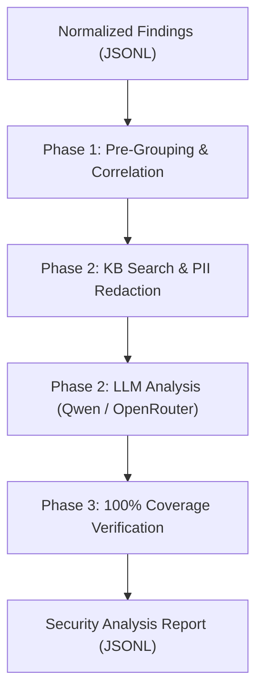

# Báo cáo Week 3 — Bổ sung Bằng chứng Cấu trúc và Security Analysis Agent

**Họ và tên:** Nguyễn Tiến Huân

**Ngày báo cáo:** 07/08/2026  
**Mục tiêu:** Nâng cấp hợp đồng Unified Findings v2.0.0 với đối tượng bằng chứng cấu trúc (`evidence`), và xây dựng Security Analysis Agent tự động phân tích lỗ hổng, truy hồi tri thức bảo mật (Knowledge Base) và gom nhóm tương quan SAST ↔ DAST.

---

## 1. Kết Quả Thực Hiện Chính

### 1.1 Chuẩn hóa Bằng chứng Cấu trúc (Evidence Enrichment - Schema v2.0.0)
- **Hợp đồng dữ liệu v2.0.0**: Thay thế v1.0.0, bắt buộc mỗi finding phải chứa cấu trúc `evidence` hợp lệ (`kind`, `code_evidence`, `http_evidence`, `quality`, `provenance`).
- **Nâng cao ngữ cảnh mã nguồn**: Tự động đọc và bổ sung tới 5 dòng ngữ cảnh trước (`context_before`) và sau (`context_after`) đoạn code bị lỗi từ target repository.
- **Bằng chứng HTTP & Phân loại chất lượng**: Lưu trữ đầy đủ request excerpt, attack payload, context note cho DAST; phân loại mức độ tin cậy bằng chứng (`direct`, `enriched`, `inferred`, `none`).

#### Ví dụ Cấu trúc `evidence` trong Unified Findings v2.0.0:
```json
{
  "evidence": {
    "kind": "code", // Giá trị "code" | "http"
    
    // sast_evidence: Dùng cho SAST (Đặt là null nếu kind = http)
    "code_evidence": { 
      "code_snippet": {
        "content": "const query = 'SELECT * FROM Users WHERE email = ' + req.body.email;", // Raw: Semgrep extra.lines | CodeQL snippet.text
        "context_before": [ // Raw: Đọc file mã nguồn trực tiếp tại dòng [startLine - 5] -> [startLine - 1]
          { "line": 29, "content": "app.post('/login', (req, res) => {" }
        ],
        "context_after": [ // Raw: Đọc file mã nguồn trực tiếp tại dòng [endLine + 1] -> [endLine + 5]
          { "line": 35, "content": "db.query(query, (err, result) => {" }
        ]
      },
      "matched_contents": [ // Raw: Semgrep extra.metavars | CodeQL []
        {
          "name": "$SOURCE",
          "content": "req.body.email"
        },
        {
          "name": "$SINK",
          "content": "db.query(query)"
        }
      ], 
      "related_context": [ // Rỗng [] nếu là Semgrep
        {
          "id": 1, // Raw: CodeQL relatedLocations[k].id
          "message": "user-provided value", // Raw: CodeQL relatedLocations[k].message.text
          "path": "routes/login.ts", // Raw: CodeQL relatedLocations[k].physicalLocation.artifactLocation.uri
          "line": 30 // Raw: CodeQL relatedLocations[k].physicalLocation.region.startLine
        }
      ],
      "redacted": false,
      "truncated": false
    },

    // dast_evidence: Dùng cho DAST (Đặt là null nếu kind = code)
    "http_evidence": {
      "request_excerpt": "POST /rest/user/login (param: email)", // Raw: ZAP ${instance.method} ${instance.uri} (param: ${instance.param})
      "matched_evidence": "SQL syntax error near ''admin''", // Raw: ZAP instance.evidence
      "context_note": "Server returned 500 Internal Server Error", // Raw: ZAP instance.otherinfo
      "attack_payload": "admin' --", // Raw: ZAP instance.attack
      "redacted": false,
      "truncated": false
    },

    "quality": "direct", // "direct" | "enriched" | "inferred" | "none"
    "provenance": "reports/raw/semgrep.json:results[0].extra.lines" // Nguồn raw truy vết
  }
}
```

### 1.2 Triển khai Security Analysis Agent

#### Sơ đồ Luồng Hoạt động (Agent Execution Pipeline):


- **Giao thức 3 Giai đoạn (3-Phase Pipeline)**:
  1. *Phase 1 (Pre-Grouping & Correlation)*: Gom nhóm findings theo `group_key`, CWE Intersection, Title Similarity và Parameter-to-DataFlow Matching. Xác định quan hệ tương quan SAST ↔ DAST (`sast_dast_suspected`).
  2. *Phase 2 (Agentic Analysis Loop)*: Vòng lặp phân tích cô lập per-group. Tự động truy hồi tri thức per-CWE từ SQLite FTS5 KB và thực hiện làm sạch dữ liệu nhạy cảm (PII/secrets redaction) trước khi gọi LLM API.
  3. *Phase 3 (Post-Processing & 100% Coverage)*: Xác minh 100% fingerprints đầu vào đều có kết quả phân tích. Tự động sinh fallback entry với `analysis_status = "error"` nếu gọi LLM fail sau max retries.
- **Hợp đồng đầu ra Schema `security_analysis_report.schema.json`**: Xuất file JSONL (1 entry / 1 fingerprint, chứa `analysis_group_id` cho UI) tại `reports/analyzed/` kèm đề xuất kiểm thử an toàn dạng dữ liệu (`proposed_test_request`).
- **Tích hợp CLI & Makefile**: Cung cấp các lệnh `make agent-analyze FINDINGS=...`, `make agent-test` (34/34 test cases passed) và `make agent-lint`.

#### Ví dụ Cấu trúc Output `security_analysis_report.json`:
```json
{
  "schema_version": "1.0.0",
  "analysis_id": "analysis_abc123def4567890abc123def4567890",
  "analysis_group_id": "grp_sqli_login",
  "analysis_status": "success",
  "fingerprint": "fp_sha256:v1:abc123def4567890abc123def4567890abc123def4567890abc123def4567890",
  "finding_id": "fnd_1234567890abcdef1234567890abcdef",
  "tool": "semgrep",
  "scan_type": "SAST",
  "title": "SQL Injection tại Chức năng Đăng nhập (Login)",
  "primary_cwe_id": "CWE-89",
  "all_cwe_ids": ["CWE-89"],
  "owasp_category": "OWASP-A03:2021",
  "location_summary": "routes/login.ts dòng 34",
  "severity": {
    "agent_assessment": "critical",
    "original_scanner": "critical",
    "rationale": "Chuỗi SQL được nối trực tiếp từ input..."
  },
  "confidence": {
    "level": "confirmed",
    "rationale": "Được xác nhận bởi cả SAST và DAST..."
  },
  "correlation_type": "sast_dast_suspected",
  "correlated_with": ["fp_sha256:v1:def4567890..."],
  "evidence_summary": "Semgrep phát hiện data flow...",
  "explanation": "Lỗ hổng SQL Injection xảy ra do...",
  "recommended_action": "Sử dụng Parameterized Queries...",
  "proposed_test_request": {
    "method": "POST",
    "endpoint": "/rest/user/login",
    "headers": {"Content-Type": "application/json"},
    "payload": {"email": "admin' --", "password": "123"},
    "rationale": "Kiểm tra SQL Injection..."
  },
  "knowledge_references": [
    {"doc_id": "cwe_89", "title": "CWE-89: SQL Injection", "relevance": "Mô tả chi tiết..."}
  ],
  "metadata": {
    "analyzed_at": "2026-08-07T10:00:00Z",
    "model": "qwen-plus",
    "prompt_version": "system_v1",
    "grouping_source": "cwe_title_hybrid",
    "retry_count": 0
  }
}
```

---

## 2. Thống Kê & Kết Quả Kiểm Thử

- **Bộ dữ liệu chuẩn hóa v2**: 165 findings (37 SAST Semgrep, 87 SAST CodeQL, 41 DAST ZAP) được gom thành 37 Analysis Groups, phát hiện 2 nhóm tương quan SAST ↔ DAST chính (SQL Injection CWE-89 & Open Redirect CWE-601).
- **Kiểm thử tự động**:
  - `make agent-test`: **34/34 passed** (Schema, Correlator, Grouper, Redaction, Analyzer Mock, Orchestrator, Edge Cases).
  - `make test`: **115/115 passed** (Regression check cho toàn bộ pipeline).
  - `make kb-test`: **105/105 passed** (Knowledge Base search).
  - `make agent-lint`: **All checks passed!**
