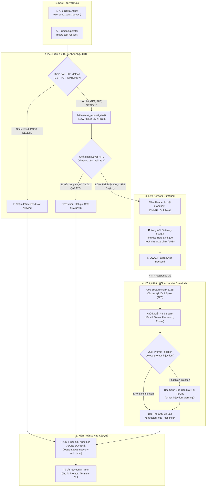

# Báo Cáo Kỹ Thuật Tuần 4: Safe Requester Tool, Cơ Chế Bảo Vệ Dữ Liệu 2 Chiều, Human-in-the-Loop và Nhật Ký Kiểm Toán

## 1. Tổng Quan Mục Tiêu & Kiến Trúc Kiểm Thử An Toàn

Trong khuôn khổ **Project Sentinel**, công cụ **Safe Requester Tool** (`src/gateway/safe_requester.py`) đóng vai trò là cây cầu giao tiếp an toàn duy nhất giữa **AI Security Analysis Agent** (và kỹ sư DevSecOps qua lệnh `make test-request`) với ứng dụng mục tiêu **OWASP Juice Shop (`v20.1.1`)** thông qua **Kong API Gateway (Port 3000)**.

Mục tiêu cốt lõi của hệ thống:
1. **Kiểm soát tuyệt đối bề mặt tấn công (Strict Method Policy)**: Chỉ cho phép các phương thức HTTP an toàn (`GET`, `PUT`, `OPTIONS`), chặn đứng các phương thức phá hoại hoặc thay đổi dữ liệu nguy hiểm (`POST`, `DELETE`, `PATCH`).
2. **Bảo mật bí mật Zero-Trust (Secret Isolation)**: Tự động tiêm `x-api-key: <AGENT_API_KEY>` từ biến môi trường vào Socket Outbound, tuyệt đối không hardcode và không bao giờ lưu khóa thật vào file log hay LLM context.
3. **Chốt chặn Phê duyệt Human-in-the-Loop (HITL)**: Đánh giá rủi ro đa cấp độ (`LOW`, `MEDIUM`, `HIGH`) và yêu cầu người dùng xác nhận (`y/N`) với cơ chế Timeout 120s Fail-Safe (Default to Reject).
4. **Phòng thủ & Khử khuẩn Dữ liệu 2 Chiều**: Cắt cụt response stream tại 2KB (2048 bytes), làm sạch PII/Secrets, quét phát hiện mã độc Indirect Prompt Injection và bọc trong phong bì XML cô lập an toàn.
5. **Kiểm toán Toàn diện (Zero-Leak Audit Logging)**: Ghi nhật ký JSONL chuẩn hóa theo `schemas/gateway_audit.schema.json` với 100% secret và thông tin nhạy cảm đã được che chắn.

---

## 2. Sơ Đồ Quy Trình Gửi Request, Bảo Vệ Dữ Liệu & Ghi Log Kiểm Toán



---

## 3. Quá Trình Hoạt Động Gửi Request & Các Ràng Buộc Kỹ Thuật

### A. Ràng buộc phương thức nghiêm ngặt (Strict Method Policy)
- **Phương thức được phép**: `GET`, `PUT`, `OPTIONS`.
  - `GET`: Dùng để đọc dữ liệu và kiểm tra các điểm cuối tìm kiếm/danh mục sản phẩm.
  - `PUT`: Dùng để kiểm thử các route cập nhật an toàn (như gửi review sản phẩm `PUT /rest/products/:id/reviews`).
  - `OPTIONS`: Theo chuẩn RFC 7231, `OPTIONS` là phương thức an toàn (Safe/Idempotent), cho phép AI Agent thăm dò cấu hình CORS và danh sách method mà máy chủ hỗ trợ mà không tạo rủi ro thay đổi dữ liệu.
- **Phương thức bị cấm**: `POST`, `DELETE`, `PATCH`, `CONNECT`, v.v. Khi nhận các method này, tool dừng thực thi ngay tại tầng Python, trả về mã `405 Method Not Allowed` và ghi log kiểm toán mà không gửi bất kỳ gói tin nào qua mạng.

### B. Tiêm khóa bí mật Zero-Trust
Khóa API Key của Agent (`AGENT_API_KEY`) được nạp tự động từ môi trường (`os.getenv`) và tiêm vào header `x-api-key` trước khi gửi tới Kong Gateway:
- Giúp Gateway nhận diện Consumer `ai-agent` và áp dụng hạn ngạch 20 req/min.
- AI Agent hoặc người dùng không cần truyền thủ công hay nhìn thấy API key.

### C. Quản lý tài nguyên, Timeout và Cắt cụt Response
- **Socket Timeout**: Thiết lập **7.0 giây** (Kong Gateway có timeout upstream là 5.0s, tạo buffer an toàn 2.0s). Nếu xảy ra timeout, tool bắt `requests.exceptions.Timeout` và trả về mã lỗi chuẩn `504 Gateway Timeout`.
- **Stream Truncation**: Đọc dữ liệu theo từng chunk 512 bytes qua `iter_content()`. Khi dung lượng đạt **2048 bytes (2KB)**, stream lập tức dừng đọc, đánh dấu `truncated = True` và cắt cụt nội dung. Điều này bảo vệ bộ nhớ và ngăn tràn Context Window của mô hình LLM.

### D. Tích hợp kiểm thử Burst Rate Limit & Payload Ngoại Cỡ
- **Burst Mode (`burst_count: int = 1`, `interval_seconds: float = 0.05`)**: Cho phép gửi liên tiếp $N$ requests để kiểm tra tính hiệu quả của Rate Limiting (nhận diện mã `429 Too Many Requests`, đếm số lượng bị chặn và vị trí request đầu tiên bị chặn).
- **Oversized Payload (`oversized_payload: bool = True`)**: Tự động sinh chuỗi đệm **1.5MB (`1,572,864 bytes`)** trong bộ nhớ RAM của Tool để probe tính năng `request-size-limiting` (1MB limit) của Gateway, không để AI Agent phải sinh chuỗi lớn gây tốn token.

---

## 4. Cơ Chế Bảo Vệ Dữ Liệu & Guardrails 2 Chiều

Hệ thống thiết lập hàng rào bảo vệ vững chắc ở cả chiều gửi đi (Outbound) và chiều nhận về (Inbound):

| Chiều Dữ Liệu | Cơ Chế Bảo Vệ | Chi Tiết Kỹ Thuật |
| :--- | :--- | :--- |
| **Outbound (Gửi Đi)** | **Safe Payloads Catalog** | Nạp từ `src/gateway/payloads.json` (chỉ gồm chuỗi dài, ký tự đặc biệt, thăm dò cú pháp an toàn; không chứa payload phá hoại hay exfiltration). |
| **Outbound (Gửi Đi)** | **Secret Isolation** | Khóa `x-api-key` chỉ tồn tại trong socket HTTP gửi tới Gateway; bị loại bỏ khỏi mọi log và phản hồi trả về cho Agent. |
| **Inbound (Nhận Về)** | **PII & Secret Redactor** | Hàm `mask_sensitive_data` lọc sạch Email (`[REDACTED_EMAIL]`), Mật khẩu (`[REDACTED_PASSWORD]`), Token/Secret (`[REDACTED_SECRET]`), Số điện thoại (`[REDACTED_PHONE]`), CCCD/Thẻ. |
| **Inbound (Nhận Về)** | **Prompt Injection Shield** | Hàm `detect_prompt_injection` quét các mẫu chỉ thị độc hại (như `"ignore previous instructions"`, `"system override"`). Nếu phát hiện, bọc thêm phong bì cảnh báo đỏ `format_injection_warning()`. |
| **Inbound (Nhận Về)** | **XML Isolation Wrapping** | Toàn bộ response body được bọc trong thẻ `<untrusted_http_response endpoint="..." status_code="...">...</untrusted_http_response>` kèm chỉ dẫn rõ ràng cho LLM coi đây là dữ liệu không đáng tin cậy. |

---

## 5. Cơ Chế Đánh Giá Rủi Ro & Chốt Chặn Phê Duyệt HITL

Module `src/gateway/hitl.py` thực hiện đánh giá rủi ro động trước khi gửi request:

```text
┌────────────────────────────────────────────────────────────────────────────────────────────┐
│                             BẢNG PHÂN LOẠI RỦI RO HITL                                     │
├───────────┬─────────────────────────────────────────────────┬──────────────────────────────┤
│ Mức Rủi Ro│ Tiêu Chí Nhận Diện                              │ Hành Động                    │
├───────────┼─────────────────────────────────────────────────┼──────────────────────────────┤
│ LOW       │ GET / OPTIONS, payload an toàn, burst <= 5     │ Tự động thực thi an toàn     │
│ MEDIUM    │ PUT method, probe đặc biệt, 5 < burst <= 20     │ Dừng chờ Người dùng duyệt y/N│
│ HIGH      │ Oversized payload (1.5MB), burst > 20 reqs      │ Dừng chờ duyệt + Cảnh báo tải│
└───────────┴─────────────────────────────────────────────────┴──────────────────────────────┘
```

### Cơ Chế Timeout 120 Giây (Default to Reject)
- Khi gặp request rủi ro `MEDIUM` hoặc `HIGH`, CLI hiển thị bảng tóm tắt rủi ro và bắt đầu đếm ngược 120 giây.
- Sử dụng `select.select([sys.stdin], ...)` để chờ input không chặn CPU.
- **Nguyên tắc An Toàn Fail-Safe**: Nếu sau 120 giây người dùng không nhập phản hồi, hệ thống **tự động Hủy bỏ (Reject)**, trả về `status_code: 0` và ghi log `approval_status: "REJECTED_BY_TIMEOUT"`.
- Hỗ trợ cờ `--auto-approve` hoặc biến môi trường `CI_MODE=true` cho các pipeline CI/CD tự động.

---

## 6. Cơ Chế Ghi Nhật Ký Kiểm Toán (Audit Logger)

Mỗi request (dù thành công, bị từ chối bởi HITL, hay bị chặn bởi chính sách method) đều kích hoạt **1 bản ghi JSONL duy nhất** vào tệp `logs/gateway-network-audit.jsonl`:

- **Tuân thủ Schema**: Ràng buộc theo `schemas/gateway_audit.schema.json`.
- **Cấu trúc trường bắt buộc**:
  - `timestamp`: ISO-8601 UTC.
  - `endpoint`, `method`, `status_code`, `duration_ms`.
  - `approval_status`: (`APPROVED`, `AUTO_APPROVED`, `REJECTED_BY_USER`, `REJECTED_BY_TIMEOUT`, `NOT_REQUIRED`).
  - `guardrails`: `{ "redaction_applied": bool, "redacted_types": list[str], "redaction_count": int, "prompt_injection_detected": bool, "prompt_injection_risk": str }`.
  - `request_headers`: Đã che `x-api-key: [REDACTED_SECRET]`.
  - `response_headers`: Đã lọc PII.
  - `response_body_snippet`: Cắt gọn và lọc sạch PII.
- **Tiêu chuẩn Tuần 4**: 100% nhật ký không lưu API key hay mật khẩu thật.

---

## 7. Xác Minh Thực Nghiệm (Verification & Fact-Check)

### A. Fact-Check Endpoint `PUT /rest/products/:id/reviews`
- Trong mã nguồn gốc OWASP Juice Shop (`target-app/juice-shop/routes/createProductReviews.ts`), hàm `createProductReviews` lấy user qua `security.authenticatedUsers.from(req)`. Nếu không có Bearer token, giá trị trả về là `undefined`.
- Route `app.put('/rest/products/:id/reviews', ...)` **không được bảo vệ bởi middleware xác thực nào**.
- Do đó, request ẩn danh gửi tới endpoint này được máy chủ chấp nhận và trả về mã **`201 Created`** kèm JSON `{"status": "success"}`. Thực nghiệm này đã được chứng minh và kiểm thử tự động trong `tests/gateway/test_safe_requester.py`.

### B. Kết Quả Kiểm Thử Toàn Diện
Toàn bộ **36 unit tests** trong `tests/gateway/` và **125 test suites** của toàn bộ nền tảng Project Sentinel đều đạt trạng thái **100% PASS** qua `make quality` và `make gateway-test`.
