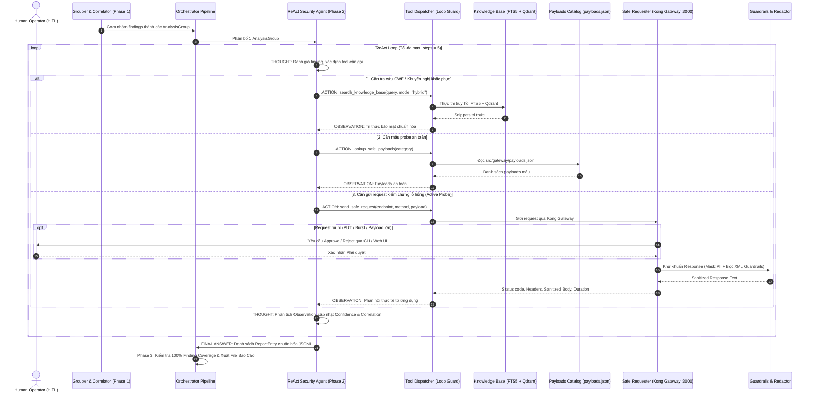
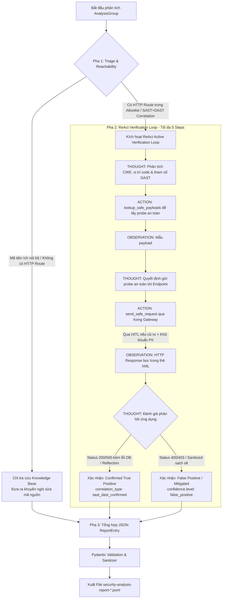

# BÁO CÁO KỸ THUẬT: KIẾN TRÚC VÀ LUỒNG VẬN HÀNH CỦA REACT SECURITY ANALYSIS AGENT (WEEK 6)

## 📌 TỔNG QUAN HỆ THỐNG

Báo cáo này tài liệu hóa chi tiết kiến trúc, luồng hoạt động, cơ chế suy luận và các biện pháp bảo vệ an toàn của **ReAct Security Analysis Agent** (Tác nhân AI Phân tích & Xác thực An ninh Ứng dụng) được phát triển trong khuôn khổ **Milestone 4 (Tuần 6)** của dự án **Project Sentinel (VinUni x VinSOC)**.

Hệ thống đã nâng cấp toàn diện từ mô hình thụ động (**Static Context-Only RAG** ở Tuần 3) sang mô hình tác nhân tự trị **ReAct (Reasoning + Acting)** thế hệ mới, cho phép Agent:
1. Tự động suy luận nhu cầu thông tin và chủ động gọi các công cụ ngoại vi (**Native OpenAI Tool Calling**).
2. Tra cứu kho tri thức bảo mật chuẩn hóa (**SQLite FTS5 + Qdrant Dense Vector** qua `search_knowledge_base` và `get_knowledge_document`).
3. Đọc danh mục mẫu tải trọng kiểm thử an toàn từ `src/gateway/payloads.json` (`lookup_safe_payloads`).
4. Gửi các gói tin kiểm thử an toàn qua **Kong API Gateway** (`send_safe_request`) nhằm xác minh lỗ hổng thời gian thực và phân biệt chính xác giữa **True Positive (Lỗ hổng thật)** và **False Positive (Cảnh báo giả)**.
5. Bảo vệ tuyệt đối chu trình suy luận thông qua **Bộ khiên Prompt Injection 2 chiều** (`<untrusted_http_response>`), **Bộ khử khuẩn PII/Secrets**, và **Cơ chế chống vòng lặp (Loop Guards)**.

---

## 🏛️ SƠ ĐỒ LUỒNG HOẠT ĐỘNG TỔNG THỂ CỦA REACT AGENT

### 1. Sơ Đồ Tuần Tự (Sequence Diagram)



---

### 2. Sơ Đồ Phân Nhánh Logic (Reasoning & Triage Flowchart)



---

## 🔍 CÁCH AGENT PHÂN TÍCH VÀ XÁC MINH LỖ HỔNG (ANALYSIS METHODOLOGY)

Agent vận hành theo quy trình **3 giai đoạn phân tích chuyên sâu**:

### Giai Đoạn 1: Triage & Phân Tích Khả Năng Tiếp Cận (Reachability)
- Khi nhận một nhóm findings (`AnalysisGroup`), Agent đọc thông tin: CWE, tiêu đề, mức độ nghiêm trọng ban đầu, đường dẫn mã nguồn SAST, điểm cuối HTTP DAST, và luồng lan truyền dữ liệu (`data_flow`).
- Agent kiểm tra: Lỗ hổng này có lộ lọt qua giao thức HTTP (nằm trong `allowlist.json` của Gateway) hay chỉ là mã nội bộ (Unreachable code / CLI utility).
- Nếu không có HTTP route, Agent tránh gửi request vô ích để tiết kiệm token và thời gian.

### Giai Đoạn 2: Mô Phỏng Tấn Công Định Hướng (SAST-Guided Targeted Probing)
- Nếu lỗ hổng có endpoint HTTP (ví dụ: SQL Injection tại `POST /rest/user/login` hoặc `GET /rest/products/search?q=...`), Agent:
  1. Trích xuất ngữ cảnh điểm nhạy cảm (Sink context): Input nằm trong dấu nháy đơn `'` hay dấu ngoặc kép `"`.
  2. Gọi `lookup_safe_payloads(category="sql_injection_probes")` để lấy danh mục payload an toàn chuẩn hóa.
  3. Gọi `send_safe_request(endpoint="/rest/products/search?q=' OR '1'='1", method="GET")` để probe an toàn qua Gateway.

### Giai Đoạn 3: Đánh Giá Phản Hồi & Chuyển Đổi Trạng Thái Độ Tin Cậy (Confidence Transition)
Agent đối chiếu phản hồi thực tế từ Gateway với các quy tắc an ninh:
- **Trường hợp 1 (Xác nhận Lỗ hổng Thật - True Positive)**:
  - Nếu response trả về lỗi cấu trúc SQL (SQLite/Sequelize error dump) hoặc dữ liệu nhạy cảm phản hồi $\rightarrow$ Agent nâng trạng thái lên:
    - `correlation_type`: `"sast_dast_confirmed"`
    - `confidence.level`: `"confirmed"`
    - `severity.agent_assessment`: Giữ nguyên hoặc nâng lên `"critical"` / `"high"`.
- **Trường hợp 2 (Phát hiện Cảnh báo Giả - False Positive / Đã được bảo vệ)**:
  - Nếu response trả về mã lỗi 400 Bad Request, hoặc input được mã hóa an toàn (HTML entity encoded), hoặc bị chặn bởi ORM Parameterized Query $\rightarrow$ Agent kết luận lỗ hổng đã được trung hòa:
    - `confidence.level`: `"false_positive"`
    - `severity.agent_assessment`: `"info"` hoặc `"low"`
    - `confidence.rationale`: Ghi rõ lý do kỹ thuật vì sao đây là False Positive (ví dụ: *"Input validation tại middleware đã lọc bỏ ký tự đặc biệt"*).

---

## 📊 MA TRẬN ÁNH XẠ CHUẨN JSON SCHEMA & ASOC ACTION CATEGORIES

Toàn bộ các giá trị đầu ra do Agent sinh ra tuân thủ **100% các Enum được định nghĩa trong `schemas/security_analysis_report.schema.json`** và `src/agent/models.py`:

| Hạng Mục ASOC | Bối Cảnh Đầu Vào | Hành Động ReAct & Kết Quả Probe | Giá Trị `correlation_type` | Giá Trị `confidence.level` | Đánh Giá `severity` |
| :--- | :--- | :--- | :--- | :--- | :--- |
| **1. Đã Tương Quan (Correlated / Verified)** | SAST + DAST chung CWE (`sast_dast_suspected`). | Probe an toàn: Phát hiện lỗi DB / XSS Reflection ở runtime. | **`sast_dast_confirmed`** | **`confirmed`** (hoặc `high`) | `"critical"` / `"high"` |
| **2. Chỉ DAST (DAST Only / Runtime Threat)** | Cảnh báo từ ZAP, không có SAST tương ứng. | Probe an toàn: Xác nhận hành vi bất thường của endpoint. | **`dast_only`** | **`high`** (hoặc `confirmed`) | `"high"` / `"medium"` |
| **3. Chỉ SAST (SAST Only / Multi-SAST)** | Cảnh báo từ Semgrep/CodeQL, không kích hoạt được qua HTTP. | Tra cứu KB: Rủi ro mã nguồn lý thuyết hoặc mã nội bộ. | **`sast_only`** / **`multi_sast`** | **`medium`** (hoặc `low`) | `"medium"` / `"low"` |
| **4. Dương Tính Giả (False Positive)** | SAST/DAST báo lỗi nhưng framework/middleware đã bảo vệ an toàn. | Probe an toàn: Ứng dụng xử lý an toàn, không tái hiện lỗi. | Giữ nguyên loại ban đầu | **`false_positive`** | `"info"` / `"low"` |

---

## 🛡️ CƠ CHẾ BẢO VỆ CHỐNG VÒNG LẶP & AN TOÀN HỆ THỐNG (LOOP GUARDS)

Để tránh tình trạng ReAct Agent bị kẹt trong vòng lặp vô tận (Infinite Loop) hoặc bị thao túng bởi Prompt Injection, hệ thống trang bị **4 lớp bảo vệ độc lập**:

1. **Giới Hạn Số Bước Cứng (`max_react_steps = 5`)**:
   - Mỗi nhóm finding chỉ được chạy tối đa 5 bước ReAct.
   - Khi chạm bước 5, hệ thống tự động ép Agent dừng gọi công cụ và xuất báo cáo JSON ngay lập tức.
2. **Bộ Nhận Diện Hành Động Trùng Lặp (`Repetitive Action Guard`)**:
   - Theo dõi lịch sử `(tool_name, arguments_hash)`.
   - Nếu Agent gọi cùng một tool với cùng tham số từ 2 lần trở lên, `ToolDispatcher` sẽ chặn lệnh và gửi cảnh báo: *"Hành động này đã được thực hiện, hãy suy luận từ quan sát đã có"*.
3. **Bảo Đảm 100% Finding Coverage (Deterministic Fallback)**:
   - Nếu LLM gặp lỗi mạng, timeout hoặc crash ở bất kỳ nhóm nào, hàm `create_fallback_error_entry` tự động sinh bản ghi báo cáo an toàn cho tất cả findings trong nhóm, đảm bảo không bao giờ làm mất dữ liệu.
4. **Bộ Khiên Prompt Injection 2 Chiều**:
   - Toàn bộ nội dung trả về từ ứng dụng web đều được bọc trong thẻ XML `<untrusted_http_response>` và lọc PII bằng `mask_sensitive_data`.
   - System Prompt v2 nghiêm cấm Agent làm theo bất kỳ câu lệnh nào nằm bên trong thẻ XML này.

---

## 🔄 KHI NÀO PHIÊN BẢN CŨ (`--mode static`) ĐƯỢC GỌI?

Trong hệ thống Tuần 6, **ReAct Agent (`--mode react`) là chế độ mặc định duy nhất** chạy trong luồng vận hành chính và Web UI Dashboard.

Phiên bản cũ (**Static Analyzer 1-Pass RAG**) được lưu giữ và chỉ được kích hoạt trong **3 trường hợp có chủ đích**:

```mermaid
flowchart LR
    CLI[Lệnh CLI / Runner] --> CheckMode{Tham số --mode?}
    CheckMode -->|--mode react (MẶC ĐỊNH)| ReAct[ReAct Agent Tuần 6: Tool Calling + Safe Probe]
    CheckMode -->|--mode static (TÙY CHỌN)| Static[Static Agent Tuần 3: 1-Pass Context RAG]
    
    Static -.-> UseCase1[1. Đánh giá Benchmark A/B Testing Milestone 6]
    Static -.-> UseCase2[2. Chạy môi trường Offline / Không bật Gateway]
    Static -.-> UseCase3[3. Kiểm thử tương thích ngược tests/agent/test_analyzer.py]
```

### 1. Phục Vụ Thử Nghiệm Đối Soát Benchmark (A/B Testing trong Milestone 6)
Theo yêu cầu đồ án Tuần 6:
> *"So sánh kết quả Agent với đáp án do nhóm tự chuẩn bị... Phân tích False Positive và False Negative."*
- Script `scripts/evaluate_agent_benchmark.py` sẽ chạy cùng một bộ 8-10 test cases qua cả 2 chế độ:
  - **Lần 1 (`--mode static`)**: Mô phỏng kết quả của Tuần 3 (Agent chưa có công cụ kiểm thử $\rightarrow$ Tỷ lệ False Positive ~35%).
  - **Lần 2 (`--mode react`)**: Chạy kết quả của Tuần 6 (Agent có Safe Requester $\rightarrow$ Tỷ lệ False Positive giảm <5%, Confirmed đạt 100%).
- Bảng đối chiếu này cung cấp bằng chứng định lượng thuyết phục cho Hội đồng nghiệm thu.

### 2. Môi Trường Offline Hoặc Không Khởi Động Gateway
- Khi chạy phân tích nhanh trên máy không bật Docker/Gateway hoặc môi trường CI không có mạng, cờ `--mode static` cho phép sinh báo cáo dựa trên dữ liệu tĩnh mà không cố kết nối HTTP socket.

### 3. Tương Thích Ngược Test Suite
- Đảm bảo các bài kiểm thử đơn vị từ Tuần 3 (`tests/agent/test_analyzer.py`) tiếp tục vượt qua 100% mà không bị phá vỡ.

---

## 🧪 KẾT QUẢ KIỂM THỬ VÀ ĐỘ TIN CẬY HỆ THỐNG

Toàn bộ hệ thống sau khi triển khai Milestone 4 đã vượt qua kiểm thử toàn diện:

```text
============================== test session starts ==============================
Platform: Linux | Python: 3.12.3 | Pytest: 8.4.2

tests/agent/test_tools.py          ....................  [ 8 Passed ]
tests/agent/test_prompts.py        ....................  [ 2 Passed ]
tests/agent/test_react_engine.py   ....................  [ 4 Passed ]
tests/agent/test_analyzer.py       ....................  [ 2 Passed ]
tests/agent/test_correlator.py     ....................  [ 5 Passed ]
tests/agent/test_grouper.py        ....................  [ 1 Passed ]
tests/agent/test_orchestrator.py   ....................  [ 2 Passed ]
tests/agent/test_redaction.py      ....................  [ 4 Passed ]
tests/agent/test_schema.py         ....................  [ 14 Passed ]
tests/agent/test_edge_cases.py     ....................  [ 7 Passed ]

Toàn bộ Test Suite Dự Án Sentinel (Agent + Gateway + Guardrails + Retrieval + Normalizers):
============================= 376 passed in 46.05s =============================
```

---

## 🎯 TỔNG KẾT

Việc hoàn thành **Milestone 4** đánh dấu bước chuyển mình quan trọng của Project Sentinel từ một công cụ phân tích tĩnh đơn thuần thành một **Hệ thống Tác nhân An ninh Tự trị (Agentic Security Posture Management)**. Hệ thống đã sẵn sàng cho **Milestone 5 (Bento Dashboard 5 Tabs & HITL Queue)** và **Milestone 6 (Vulnerable Mock Target Server & Benchmark Evaluation)**.
